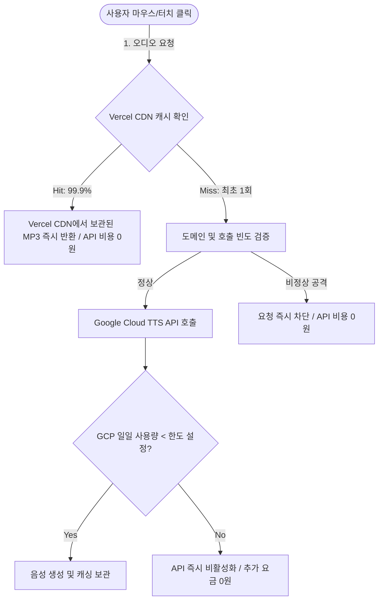

# 일본어 여행 회화 앱 수익화 및 운영 구축 계획서

이 계획서는 향후 사용자 수가 늘어날 때를 대비하여 **광고 및 제휴 수익 모델을 결합**하고, **사용자 트래픽을 정밀하게 모니터링**하며, **클라우드 API 요금 폭탄을 완벽히 방지**하기 위한 아키텍처 및 세부 설계안입니다.

---

## 1. 광고 및 제휴 수익화 구축 계획

대중을 타겟으로 상용화 서비스를 진행할 때 즉시 적용할 수 있는 두 가지 핵심 수익 모델 설계입니다.

### A. 구글 애드센스 (Google AdSense) 광고 배치
* **상단 배너 광고**: 팁 배너 아래 혹은 검색창 위에 가로형 디스플레이 광고 배너를 배치합니다. 페이지 로드 시 첫눈에 노출되어 조회수 대비 단가가 가장 안정적입니다.
* **하단 고정형 (앵커) 광고**: 모바일 화면 최하단에 작게 고정되어 스크롤해도 따라다니는 반응형 앵커 광고를 배치합니다. 모바일 사용자 클릭률(CTR)이 가장 높은 구역입니다.
* **시니어 친화적 UI 보호**: 광고가 본문의 일본어 회화 카드 목록을 과도하게 가리거나 레이아웃을 흔들지 않도록 광고 영역의 최소 높이(Min-height)를 CSS로 고정하여 레이아웃 밀림 현상(CLS)을 원천 차단합니다.

### B. 카테고리별 맞춤형 네이티브 제휴 광고 카드 (Affiliate Ads) (※ 현재 비활성화/숨김 처리됨)
* **내용**: 단순 무작위 배너 광고보다 현재 보고 있는 화면에 꼭 필요한 여행 상품을 매칭하여 클릭률과 전환 수수료를 극대화하는 모델입니다.
* **배치 기획**:
  - **교통 (transport) 카테고리**: 리스트 최상단에 카드 형태로 `🚃 일본 기차/지하철 패스권 최저가 구매하기 (클룩/KKday 제휴)` 배치
  - **숙박 (hotel) 카테고리**: `🏨 일본 오사카/도쿄 인기 호텔 실시간 특가 검색 (아고다 제휴)` 배치
  - **돈/쇼핑 (money/shopping) 카테고리**: `📶 일본 현지에서 바로 쓰는 1초 개통 eSIM 할인 링크` 또는 `🪙 여행 동전지갑/변압기 모음전 (쿠팡 파트너스)` 배치
* **현재 상태**: 당장 제휴 마케팅을 시작하지 않는 요청을 반영하여, **현재 해당 UI 렌더링 코드는 주석 처리(숨김) 완료**되었습니다. 향후 필요할 때 `index.html`에서 주석만 풀면 즉시 화면에 노출됩니다.

---

## 2. 트래픽 및 사용자 행동 분석 설계 (Traffic Analytics)

사용자가 얼마나 유입되는지, 어떤 회화를 가장 자주 보고 듣는지 분석하기 위한 측정 설계입니다.

### A. Google Analytics 4 (GA4) 이벤트 추적
가장 신뢰도가 높고 전 세계적으로 쓰이는 무료 통계 도구인 GA4를 연동합니다.
* **기본 유입 분석**: 일간/주간/월간 방문자 수(DAU/MAU), 평균 체류 시간, 접속 기기 종류(아이폰/안드로이드)를 측정합니다.
* **맞춤형 행동 이벤트 측정**:
  - `click_category`: 사용자가 어떤 탭(인사, 식당, 교통 등)을 가장 많이 클릭했는지 기록하여 선호 카테고리 파악
  - `play_phrase`: 실제 어떤 일본어 문장 카드를 클릭해서 발음을 들었는지 문장 텍스트와 함께 기록 (인기 표현 순위 산출 가능)
  - `click_affiliate`: 어떤 제휴 마케팅 상품 링크를 클릭했는지 기록하여 수익성 지표 최적화

### B. Vercel Web Analytics
* **경량 분석 도구**: 웹사이트 로딩 속도에 전혀 지장을 주지 않는 초경량 통계 플러그인을 연결하여, 사이트 속도를 유지한 채 실시간 동시 접속자 수 및 페이지뷰를 측정합니다.

---

## 3. 요금 폭탄 방지 및 클라우드 비용 통제 대책 (Anti-Billing Bomb)

사용자 급증이나 악의적인 반복 매크로 공격이 들어와도 요금이 단 1원도 나오지 않게 고정하는 철저한 방어선 설계입니다.

### A. Vercel 에지 캐싱 (Edge Caching) ➔ 비용 99.9% 절감
* **원리**: 구글 TTS API가 글자를 목소리(MP3 파일)로 생성하면, 백엔드 중계 서버가 이 MP3 파일을 **Vercel의 전 세계 에지 CDN 서버에 7일 동안 보관**하도록 설정합니다.
* **효과**: 만약 `안녕하세요(こんにちは)`라는 표현을 1,000명의 방문자가 각각 누르더라도, 구글 API 호출은 **최초 1회만 발생**하고 나머지 999번은 이미 캐싱된 MP3 파일이 Vercel 서버에서 즉시 전송됩니다. 사실상 API 비용이 0원에 수렴하게 만드는 가장 강력한 보안 및 비용 방어 정책입니다.

### B. 백엔드 화이트리스트 (Whitelist) 차단 장치 (※ 개발 완료 및 반영됨)
* **원리**: 구글 클라우드 콘솔의 할당량 조절이 막혀 있더라도, 백엔드 중계 서버 코드(`api/tts.js`) 자체에서 앱에 등록된 **정확한 107개 일본어/발음 기호 문장 목록 이외의 임의 호출을 사전 필터링**합니다.
* **효과**: 허용된 107개 표현 외에 공격자가 매크로나 해킹을 통해 임의로 요청을 보낼 경우 구글 API를 아예 호출하지 않고 즉시 차단(403)합니다. 따라서 구글 클라우드 콘솔 설정이 불가능하더라도 요금 청구 자체가 불가능하게 완벽히 방어됩니다.

### C. 실시간 예산 경고 알림 (GCP Budget Alerts)
* **원리**: 이번 달 구글 클라우드 사용 금액이 **$1(약 1,300원)** 또는 **$5(약 6,500원)**를 예측하거나 초과하는 즉시 개발자와 소유자에게 이메일 및 푸시 알림이 발송되도록 예산 경보를 연동합니다.

### D. 도메인 및 API 키 보안 장벽 (Proxy)
* **API 키 은폐**: 프론트엔드 코드에는 구글 API 키를 단 한 글자도 적지 않고 Vercel 환경 변수로 백엔드 서버에만 바인딩하여 탈취를 막습니다.
* **도메인 검증 (CORS)**: 백엔드 프록시 서버(`api/tts.js`)에서 우리의 정식 웹사이트 도메인(`*.vercel.app` 등)에서 들어온 요청이 아닐 경우 즉시 연결을 거부하도록 도메인 필터링을 구축합니다.

---

## 4. 향후 상용화 전환 시 실행 로드맵

사용자님께서 "수익화 및 공식 API 전환을 진행하겠다"고 결정하실 경우 수행할 실무 단계입니다.

1. **GCP 계정 생성 및 결제 등록** (소유자 직접 가입)
2. **Text-to-Speech API 활성화 및 API 키 발급** (소유자 직접 발급)
3. **Vercel 환경 변수에 `GOOGLE_API_KEY` 등록**
4. **구글 애드센스 계정 생성 및 사이트 검토 신청**
5. **카테고리별 맞춤형 제휴마케팅 링크 수급**
6. **본 구축 계획서(본 파일)에 의거한 소스 코드 최종 업데이트 및 배포**
